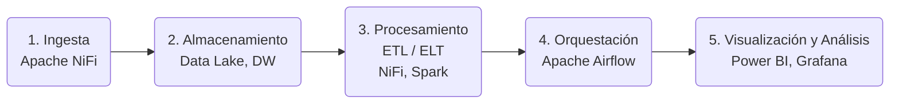

   Fundamentos y Ecosistema Moderno de Big Data

#  

¡Bienvenidos al curso de Big Data Aplicado! Este primer módulo es la puerta de entrada al fascinante universo de los datos a gran escala. Olvídate de las definiciones abstractas; aquí vamos a entender **por qué** el Big Data es una de las áreas más revolucionarias de la tecnología actual.

No nos quedaremos solo en la teoría de las "5 V"; exploraremos el **ecosistema de herramientas real** que usan empresas como Netflix, Airbnb o Spotify, conocido como el "Modern Data Stack". Entenderemos los distintos roles profesionales que existen en este campo y, lo más importante, presentaremos los **dos proyectos que serán nuestra guía práctica** durante las próximas sesiones de clase. El objetivo es que, al finalizar este módulo, tengas un mapa completo del territorio que vamos a explorar y los emocionantes retos que vamos a superar juntos.

## 1. ¿Qué es Big Data? Más allá de "muchos datos"

El Big Data se refiere a conjuntos de datos masivos y complejos que, por su volumen, variedad y velocidad, superan la capacidad de las herramientas tradicionales para su almacenamiento y procesamiento. Su principal objetivo es extraer información valiosa, patrones y conocimientos para tomar mejores decisiones, optimizar procesos y desarrollar soluciones inteligentes en diversos ámbitos como la medicina, el marketing o la gestión del tráfico. 

Imagina que pasas de tener una libreta de contactos (un Excel) a tener que gestionar la agenda de teléfonos de todo un país, que además se actualiza cada segundo. Esa es la esencia del Big Data: los problemas y oportunidades que surgen cuando los datos superan la capacidad de las herramientas tradicionales.

Para entenderlo mejor, usamos el modelo de las **5 "V"**:

### 1.1. Las 5 "V" del Big Data

- **Volumen (Cantidad):** Se refiere a la escala masiva de los datos generados. Ya no hablamos de Megabytes o Gigabytes, sino de **Terabytes, Petabytes o incluso Exabytes**.
    - *Ejemplo:* Las horas de vídeo subidas a YouTube cada minuto, o los datos de transacciones de una cadena de supermercados global.
    - *Reto:* ¿Cómo almacenamos y accedemos a esta cantidad ingente de información de forma eficiente y económica?
- **Velocidad (Ritmo):** Se refiere al ritmo al que los datos se crean, transmiten y procesan. Muchas veces, necesitamos analizarlos en **tiempo real** o casi real.
    - *Ejemplo:* El torrente de tuits durante la final de un mundial, los datos de sensores de un coche autónomo o las transacciones con tarjeta de crédito que deben ser validadas en milisegundos.
    - *Reto:* ¿Cómo capturamos y procesamos datos que "vuelan" sin perder información valiosa?
- **Variedad (Formatos):** Los datos ya no son solo tablas ordenadas en una base de datos. Vienen en múltiples formatos.
    - **Datos Estructurados:** Altamente organizados, como una tabla de Excel o una base de datos SQL.
    - **Datos Semi-estructurados:** No encajan en una tabla, pero tienen una estructura interna, como un fichero JSON o XML.
    - **Datos No Estructurados:** No tienen un modelo predefinido, como un email, una imagen, un vídeo, un audio o un post en redes sociales.
    - *Ejemplo:* Un único post de Instagram puede contener una imagen (no estructurado), un texto con #hashtags (semi-estructurado) y metadatos como la geolocalización (estructurado).
    - *Reto:* ¿Cómo extraemos información útil de esta mezcla heterogénea de formatos?

??? info  "Tipos de datos"
    | Tipo de Datos | Descripcion | Formatos comunes | Ejemplos | Observaciones| 
    | -- | -- |-- | -- | -- |
    |**Archivos de Datos Estructurados** | Datos organizados en un formato con una estructura fija y predefinida, como las tablas de una base de datos relacional.| CSV | Archivos de hojas de cálculo, bases de datos SQL y archivos CSV. |Los archivos estructurados son eficientes para almacenar datos tabulares, pero pueden ser menos flexibles para datos variados o no estructurados. |
    | **Archivos de Datos Semiestructurados** | No siguen una estructura fija como los datos estructurados, pero tienen cierta organización o jerarquía, como en el caso de archivos JSON o XML. | JSON y XML |  Archivos JSON que almacenan configuraciones, datos de sensores o información de productos. | Los datos semiestructurados son ideales para representar información jerárquica, como configuraciones de aplicaciones o datos de sensores. |
    | **Archivos de Datos No Estructurados** | Carecen de una organización o formato definido y pueden incluir archivos de imágenes, videos, documentos de texto sin formato y audio, entre otros. | | Imágenes JPEG, videos MP4, documentos de texto sin formato, grabaciones de audio, etc. | Se utilizan herramientas de procesamiento de medios, visión por computadora, reconocimiento de voz y análisis de texto para extraer información de datos no estructurados. |
    | **Archivos de Log** | Registran eventos y actividades, como transacciones, errores o interacciones de usuarios. |  |  | Herramientas como Splunk, ELK Stack (Elasticsearch, Logstash, Kibana) y Apache Flume se utilizan para analizar y visualizar datos de registros. |

- **Veracidad (Confianza):** Se refiere a la calidad y fiabilidad de los datos. No todos los datos son precisos. Pueden tener ruido, sesgos, inconsistencias o simplemente ser falsos.
    - *Ejemplo:* Reseñas falsas de productos en Amazon, errores en lecturas de sensores por un fallo de hardware, o datos introducidos manualmente con erratas.
    - *Reto:* ¿Cómo limpiamos los datos y nos aseguramos de que podemos confiar en ellos para tomar decisiones? *Garbage In, Garbage Out* (si entra basura, sale basura).
- **Valor (Propósito):** Esta es la "V" más importante. De nada sirve tener un océano de datos si no podemos extraer de él conocimiento útil (**insights**) que nos permita tomar mejores decisiones, optimizar procesos, crear nuevos productos o entender mejor a nuestros clientes.
    - *Ejemplo:* Netflix analiza qué ven sus millones de usuarios (volumen, velocidad, variedad) para decidir qué series producir (valor).
    - *Reto y Objetivo Final:* ¿Cómo transformamos los datos crudos en valor tangible para una organización?

### 1.2. Roles Profesionales en el Mundo del Dato

Para gestionar estas 5 "V", han surgido roles especializados. Pensemos en ellos como un equipo de construcción:

- **👷‍♀️ Ingeniero de Datos (Data Engineer):** Es el arquitecto e ingeniero civil del mundo de los datos. Su trabajo es diseñar, construir y mantener las "autopistas" por las que viajarán los datos. Crea los pipelines (tuberías) que recogen datos de las fuentes (APIs, bases de datos, ficheros) y los llevan a un lugar centralizado (Data Lake o Data Warehouse) de forma limpia y eficiente. **En este curso, adoptaremos principalmente este rol.**
    - *Herramientas:* SQL, Python, **Apache NiFi**, Airflow, Spark, bases de datos NoSQL.
- **👨‍💼 Analista de Datos (Data Analyst):** Es el intérprete o el traductor. Una vez que los datos están en el destino, el analista los explora, los analiza y crea informes y visualizaciones (dashboards) para responder a preguntas de negocio concretas. Busca tendencias, patrones y "qué ha pasado".
    - *Herramientas:* SQL, **Power BI**, Tableau, Excel.
- **👩‍🔬 Científico de Datos (Data Scientist):** Es el "adivino" o estratega. Va un paso más allá del analista. Utiliza métodos estadísticos y algoritmos de Machine Learning para hacer predicciones y responder a "qué pasará" o "qué podemos hacer para que algo ocurra".
    - *Herramientas:* Python (con librerías como Scikit-learn, TensorFlow), R, estadística, Machine Learning.

## 2. El Ecosistema de Datos Moderno

El "sótano de servidores" de las empresas ha dado paso a la nube. El ecosistema moderno de datos se basa en servicios flexibles, escalables y potentes ofrecidos por proveedores cloud.

**¿Por qué la nube?**

- **Escalabilidad:** Paga solo por lo que usas y aumenta la capacidad con un clic.
- **Flexibilidad:** Accede a una enorme gama de herramientas especializadas.
- **Mantenimiento Reducido:** El proveedor se encarga de la infraestructura física.

**Principales Proveedores:**

- **AWS (Amazon Web Services):** El pionero y líder del mercado.
- **Microsoft Azure:** Fuerte integración con el ecosistema de Microsoft.
- **GCP (Google Cloud Platform):** Muy potente en análisis de datos y Machine Learning.

     

### 2.1.El Ciclo de Vida del Dato en el Ecosistema Moderno

Pensemos en el viaje que hacen los datos como una cadena de montaje. Cada etapa tiene un propósito específico:

1. **Ingesta (Ingestion):** Es el punto de partida. ¿Cómo metemos los datos en nuestro sistema?
    - *Fuentes:* APIs de redes sociales, sensores IoT (como en nuestro **Proyecto Smart City**), bases de datos de la empresa, ficheros CSV (como en nuestro **Proyecto Análisi Académico**).
    - *Herramientas:* **Apache NiFi**, Fivetran, Airbyte.
2. **Almacenamiento (Storage):** ¿Dónde guardamos los datos?
    - **Data Lake:** Un gran "lago" de datos crudos. Almacena todo en su formato original. Es barato y muy flexible. Ideal para datos no estructurados y para que los Científicos de Datos exploren.
    - **Data Warehouse:** Un "almacén" de datos estructurados, limpios y ordenados. La información está modelada y lista para ser analizada y generar informes (BI).
    - **Data Lakehouse:** La arquitectura moderna que une ambos mundos. Permite tener la flexibilidad y bajo coste de un Data Lake con las capacidades de gestión y rendimiento de un Data Warehouse.
3. **Procesamiento (Processing - ETL vs. ELT):** ¿Cómo transformamos los datos crudos en datos útiles?
    - **ETL (Extract, Transform, Load):** El método tradicional. Se extraen los datos, se transforman en un servidor intermedio y luego se cargan ya limpios en el Data Warehouse.
    - **ELT (Extract, Load, Transform):** El método moderno, potenciado por la nube. Se extraen los datos y se cargan **inmediatamente** en el Data Lake/Warehouse. La transformación se hace *después*, aprovechando la potencia de cálculo del sistema de almacenamiento. Es más rápido y flexible.
    - *Herramientas:* **Apache NiFi** (ideal para ETL visual), dbt (data build tool), Apache Spark.
4. **Orquestación (Orchestration): El Director de Orquesta**
    - **¿Qué es?** Es el proceso de **automatizar, programar y coordinar** la ejecución de todos nuestros flujos de datos. Un flujo de ETL no sirve de mucho si tenemos que ejecutarlo a mano cada día. La orquestación se encarga de que todo funcione solo.
    - **Analogía:** Piensa en los flujos de NiFi como los músicos de una orquesta. Cada uno sabe tocar su instrumento (procesar datos). El orquestador es el **director de orquesta**: les dice cuándo empezar, en qué orden tocar, y qué hacer si uno de ellos falla.
    - **Propósito:** Define las dependencias ("*no empieces a procesar los datos hasta que no se hayan cargado por completo*"), gestiona los reintentos en caso de error y nos da una visión centralizada de la salud de todos nuestros procesos.
    - *Herramientas:* **Apache Airflow** (el estándar de la industria, que define los flujos como código en "DAGs" o Grafos Acíclicos Dirigidos), Mage, Prefect.
5. **Visualización y Análisis (Analytics & BI):** ¿Cómo le damos sentido a los datos?
    - Es la capa final, donde los datos se convierten en gráficos, informes y cuadros de mando interactivos que aportan **valor** al negocio.
    - *Herramientas:* **Microsoft Power BI** y Tableau (para Business Intelligence), **Grafana** (para monitorización y datos en tiempo real).

/// html | div[style='text-align: center;']

///

## 3. Presentación de los Proyectos del Curso

La mejor forma de aprender es construyendo. Estos dos proyectos serán nuestro hilo conductor. Cada módulo nos dará una pieza para avanzar en ellos.

### 3.1. Proyecto 1: Smart City - El Pulso de la Ciudad en Tiempo Real

- **El Reto:** Simular una ciudad inteligente. Capturaremos datos de sensores de temperatura, CO2 y calidad del agua, los procesaremos en tiempo real y crearemos un panel de control para monitorizar la "salud" de la ciudad.
- **Conceptos Clave que Aplicaremos:**
    - Ingesta de datos IoT (FIWARE).
    - Bases de datos NoSQL.
    - Creación de flujos de datos en tiempo real con **Apache NiFi**.
    - Visualización de series temporales y alertas con **Grafana**.
- **Resultado Final:** Un dashboard operativo que nos muestre en directo qué está pasando en nuestra ciudad.

### 3.2. Proyecto 2: Análisis Académico - Inteligencia para la Educación

- **El Reto:** Ayudar a un centro educativo a entender sus resultados académicos. Partiremos de varios ficheros CSV "sucios" y los transformaremos en un sistema de Business Intelligence (BI) coherente que permita tomar decisiones.
- **Conceptos Clave que Aplicaremos:**
    - ETL por lotes para limpiar y unir datos de ficheros.
    - Diseño de un Data Warehouse con un **esquema en estrella**.
    - Uso de **Apache NiFi** para automatizar la limpieza y carga de datos.
    - Creación de un cuadro de mando interactivo con **Power BI**.
- **Resultado Final:** Un informe en Power BI que permita al equipo directivo filtrar por curso, año o ciclo y analizar tasas de éxito, promociones, etc.

[Proyectos](../PDF/Proyectos.pdf){target="_blank"}

## 4. Práctica Inicial

Vamos a empezar a "pensar en datos" desde el primer día.

### Tarea 1: Diseño del ADN de los Sensores (Proyecto Smart City)

**Objetivo:** Entender la importancia de modelar los datos antes de empezar. Un buen diseño inicial nos ahorrará muchos problemas.

**Instrucciones:**

1. Crea un Repositorio Git Hub para ir añadido todo el trabajo del proyecto

2. Abre un editor de texto simple (Bloc de Notas, VS Code) o una hoja de cálculo.

3. Crea una entidad para el sensor de temperatura definiendo su estructura.

4. Crea una estructura similar para:

    - El sensor de CO2 (con un atributo `co2` en `ppm`)
    - El sensor de calidad del agua (con `ph`, `chlorine` en `mgL`, etc.). 

5. No te preocupes por la sintaxis perfecta, céntrate en definir los **atributos, sus tipos de dato y sus unidades**.

### Tarea 2: La Primera Inspección: (Proyecto Análisis Académico)

**Objetivo:** Desarrollar un "ojo crítico" para la calidad de los datos. Es una de las habilidades más importantes de un profesional del dato.

  
**Instrucciones:**

1. Crea un Repositorio Git Hub para ir añadido todo el trabajo del proyecto
2. Descarga los ficheros CSV del proyecto académico.
3. Ábrelos con Microsoft Excel, Google Sheets o un visor de CSV. **No modifiques nada todavía.**
4. Conviértete en un detective y responde a estas preguntas para cada fichero:
    - ¿Cuál es el separador de columnas (coma `,` o punto y coma `;`)?
    - ¿La primera fila contiene los nombres de las columnas (encabezados)? ¿Son claros?
    - Inspecciona visualmente las primeras 20-30 filas. ¿Ves valores que te parezcan extraños o que faltan (celdas vacías, "N/A", "s/d")?
    - ¿Los formatos son consistentes? Por ejemplo, ¿las fechas están siempre como `DD/MM/AAAA` o a veces cambian?
    - Identifica las "claves" o "IDs" que podrían servir para relacionar unos ficheros con otros (ej: `id_alumno` en el fichero de `calificaciones.csv` y también en `alumnos.csv`).
5. Apunta tus hallazgos en un documento de texto. Este será nuestro punto de partida para la limpieza de datos en módulos posteriores.
