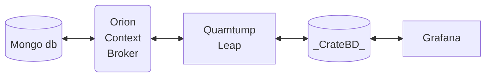

<div class="titulo">
   Bases de Datos NoSQL
</div>
#  

No todos los datos encajan perfectamente en las estructuras rígidas de filas y columnas de las bases de datos relacionales (SQL) que conocemos. En el mundo del Big Data, los datos pueden ser **variados** (estructurados, semi-estructurados, no estructurados), masivos (**volumen**)y generados a gran **velocidad**. 

Aquí es donde entran en juego las bases de datos **NoSQL** (Not Only SQL), una categoría de sistemas de gestión de bases de datos que ofrecen una flexibilidad, escalabilidad y rendimiento excepcionales para estos escenarios.

En este tema, no solo exploraremos los fundamentos de NoSQL, sino que los aplicaremos a un caso de uso real y relevante: la plataforma **FIWARE** para la gestión de datos de Internet de las Cosas (IoT). Utilizaremos FIWARE para manejar los datos en tiempo real de los sensores de nuestro **Proyecto 1**, aprendiendo cómo esta plataforma se integra con distintas bases de datos NoSQL para gestionar el estado actual y el historial de los datos.

## 1. Introducción a NoSQL

Las bases de datos relacionales (SQL) son fantásticas para datos que se ajustan a un esquema fijo y tienen relaciones bien definidas (ej. un cliente tiene muchos pedidos). Sin embargo, cuando los datos son heterogéneos y cambian constantemente, como en una red de sensores IoT, las bases de datos NoSQL ofrecen una solución más ágil y eficiente.

**Ventajas de NoSQL:**

- **Flexibilidad de esquema:** No hay un esquema predefinido. Puedes almacenar diferentes tipos de datos dentro de la misma colección, lo cual es ideal para datos semi-estructurados como JSON.
- **Escalabilidad horizontal:** Las bases de datos NoSQL están diseñadas para escalar fácilmente en clústeres de servidores de bajo coste. Esto se conoce como escalabilidad horizontal y es crucial para manejar enormes volúmenes de datos.
- **Rendimiento:** Al estar diseñadas para casos de uso específicos, muchas bases de datos NoSQL ofrecen un rendimiento superior para lecturas y escrituras intensivas.


## 2. Tipos de Bases de Datos NoSQL

Cada tipo de base de datos NoSQL está optimizado para un propósito diferente. Entender sus características te ayudará a elegir la herramienta adecuada para cada tarea.

- **Bases de Datos de Documentos (Document Stores):**
    - **Concepto:** Almacenan datos en documentos similares a JSON (MongoDB usa BSON, una versión binaria de JSON). Cada documento puede tener un esquema diferente, lo que las hace increíblemente flexibles.
    - **Ejemplo:** **MongoDB**.
    - **Casos de uso:** Sistemas de gestión de contenidos, catálogos de productos y, en nuestro caso, el estado actual de las entidades de IoT.
- **Bases de Datos de Clave-Valor (Key-Value Stores):**
    - **Concepto:** El tipo más simple de NoSQL. Cada dato es un par **clave-valor**. Son extremadamente rápidas para operaciones de lectura y escritura.
    - **Ejemplos:** **Redis** (memoria), **DynamoDB** (Amazon).
    - **Casos de uso:** Caching de datos, gestión de sesiones de usuarios y tablas de búsqueda rápidas.
- **Bases de Datos Columnares (Wide-Column Stores):**
    - **Concepto:** En lugar de almacenar datos por filas, los almacenan por columnas. Esto las hace muy eficientes para consultas analíticas sobre grandes conjuntos de datos, ya que solo se leen las columnas necesarias.
    - **Ejemplo:** **Cassandra**.
    - **Casos de uso:** Analítica de Big Data, series de tiempo (Time Series) y bases de datos de eventos.
- **Bases de Datos de Grafos (Graph Databases):**
    - **Concepto:** Almacenan datos y las relaciones entre ellos en una estructura de grafo, donde los datos son **nodos** y las relaciones son **aristas**. Son ideales para analizar interconexiones complejas.
    - **Ejemplo:** **Neo4j**.
    - **Casos de uso:** Redes sociales, detección de fraude y sistemas de recomendación.

## 3. MongoDB

MongoDB es una base de datos NoSQL de tipo **documental**. A diferencia de las bases de datos relacionales que usan tablas, MongoDB organiza los datos en **colecciones**, que son equivalentes a las tablas, y cada colección contiene **documentos**, que son equivalentes a las filas.

La clave de MongoDB es que cada documento es una estructura flexible, similar a **JSON** (JavaScript Object Notation), que puede contener campos anidados, listas y otros documentos. Esto elimina la necesidad de un esquema fijo y hace que sea ideal para datos semi-estructurados.

### 3.1. Conceptos Clave:

- **Documento:** Un registro individual en MongoDB. Es una estructura de datos en formato **BSON** (una versión binaria de JSON), que puede tener diferentes campos y tipos de datos.
- **Colección:** Un grupo de documentos. Es el equivalente a una tabla en bases de datos relacionales. No se aplica un esquema estricto a los documentos de una colección.
- **Base de Datos:** Un contenedor físico para colecciones. Puedes tener múltiples bases de datos en una misma instancia de MongoDB.

### 3.2. Comandos Básicos de MongoDB

Para interactuar con MongoDB, usaremos el **Mongo Shell**. A continuación, los comandos más comunes:

**1. Ver bases de datos y cambiar de base de datos**

- `show dbs;` : Muestra todas las bases de datos disponibles.
- `use [nombre_base_de_datos];` : Selecciona o crea una base de datos. Por ejemplo, `use fiware_db;`.

**2. Insertar Documentos**

- `db.[nombre_coleccion].insertOne({ ... });` : Inserta un único documento.
  
``` json
    db.sensores.insertOne({
      id_sensor: "temp01",
      tipo: "temperatura",
      ubicacion: "sala_servidores",
      valor_actual: 24.5,
      unidad: "celsius"
    })
```

- `db.[nombre_coleccion].insertMany([{ ... }, { ... }]);` : Inserta múltiples documentos.
```json
db.sensores.insertMany([
  {
    "id_sensor": "temp01",
    "tipo": "temperatura",
    "ubicacion": "sala_servidores",
    "valor_actual": 24.5,
    "unidad": "celsius"
  },
  {
    "id_sensor": "hum02",
    "tipo": "humedad",
    "ubicacion": "almacen_datos",
    "valor_actual": 55,
    "unidad": "porcentaje"
  },
  {
    "id_sensor": "co2_03",
    "tipo": "dioxido_carbono",
    "ubicacion": "oficina_principal",
    "valor_actual": 415,
    "unidad": "ppm"
  }
])
```
**3. Buscar Documentos**

- `db.[nombre_coleccion].find();` : Encuentra todos los documentos de una colección.
- `db.[nombre_coleccion].find({ [criterio] });` : Busca documentos que coincidan con un criterio específico. 

```json
    db.sensores.find({ tipo: "temperatura" });
```

- `db.[nombre_coleccion].findOne({ ... });` : Devuelve el primer documento que coincide.
- `db.[nombre_coleccion].find().pretty();` : Muestra los resultados de forma legible.

**4. Actualizar Documentos**

- `db.[nombre_coleccion].updateOne({ [criterio] }, { $set: { [campo]: [valor] } });` : Actualiza un solo documento.

```json
    db.sensores.updateOne(
    { "id_sensor": "temp01" },          // Criterio de búsqueda: el documento con id_sensor "temp01"
    { $set: { "ubicacion": "cuarto_control" } } // Acción: establece el campo "ubicacion" a "cuarto_control"
    )
```

- `db.[nombre_coleccion].updateMany({ [criterio] }, { $set: { [campo]: [valor] } });` : Actualiza múltiples documentos.

```json
    db.sensores.updateMany(
    { "tipo": "temperatura" },          // Criterio de búsqueda: todos los documentos con tipo "temperatura"
    { $set: { "unidad": "grados_centigrados" } } // Acción: establece el campo "unidad" a "grados_centigrados"
    )
```

**5. Eliminar Documentos**

- `db.[nombre_coleccion].deleteOne({ [criterio] });` : Elimina el primer documento que coincide.

```json
    db.usuarios.deleteOne({ email: "ejemplo@dominio.com" });
```

- `db.[nombre_coleccion].deleteMany({ [criterio] });` : Elimina todos los documentos que coinciden.


### 3.3. Ejercicios Prácticos

Imagina que tienes una base de datos llamada `iot_data` para el Proyecto 1.

**Ejercicio 1: Crear una base de datos e insertar un sensor**

1. Abre el Mongo Shell y crea una base de datos llamada `iot_data`.
2. Crea una colección llamada `dispositivos`.
3. Inserta un documento en la colección `dispositivos` con la siguiente información:
    - `id_sensor`: "temp01"
    - `tipo`: "temperatura"
    - `ubicacion`: "sala_servidores"
    - `valor_actual`: 24.5
    - `unidad`: "celsius"

**Ejercicio 2: Insertar múltiples sensores y buscar por tipo**

1. Inserta dos nuevos documentos en la colección `dispositivos`: uno para un sensor de humedad (`hum01`) y otro para un sensor de CO2 (`co201`), con valores y ubicaciones que elijas.
2. Busca y muestra solo los documentos de los sensores de tipo "temperatura".


**Ejercicio 3: Actualizar el valor de un sensor**

1. Actualiza el valor actual del sensor con `id_sensor: "temp01"` a 25.8.
2. Verifica que el valor se haya actualizado correctamente buscando el documento del sensor.

**Ejercicio 4: Eliminar un sensor**

1. Elimina el documento del sensor de CO2 (`co201`) de la colección.
2. Verifica que el documento ya no exista.


## 4. FIWARE y MongoDB

**FIWARE** es una iniciativa de código abierto que proporciona un conjunto de estándares y componentes de software para acelerar el desarrollo de soluciones inteligentes en diversos dominios como Ciudades Inteligentes (Smart Cities), Industria Inteligente (Smart Industry) y Agricultura Inteligente (Smart Agrifood).

El objetivo principal de FIWARE es romper los silos de datos, ofreciendo una forma universal de gestionar y compartir información. Esta información se conoce como **"información de contexto"**, que representa el estado de los objetos del mundo real (como un vehículo, un sensor o una habitación) y entidades conceptuales (como una orden de trabajo).

### 4.1. ¿Cómo Funciona FIWARE? La Arquitectura del Bróker de Contexto

El funcionamiento de FIWARE gira en torno a un componente central y un protocolo de comunicación estandarizado. La arquitectura está diseñada para ser modular, escalable y distribuida.


**1. El Corazón de FIWARE: El Orion Context Broker**

El componente central de cualquier solución basada en FIWARE es el **Orion Context Broker**. Su única función es gestionar todo el ciclo de vida de la información de contexto: recibir actualizaciones, procesar consultas y enviar notificaciones. Podemos pensar en él como una base de datos central en tiempo real que almacena el estado actual de todas las entidades. Por defecto, utiliza **MongoDB** para persistir esta información, ya que el modelo de documentos de MongoDB se adapta perfectamente a la naturaleza flexible y semi-estructurada de los datos de contexto (generalmente en formato JSON).

**2. El Estándar de Comunicación: NGSI (Next Generation Service Interfaces)**

Los componentes se comunican con el Orion Context Broker utilizando una API abierta y estandarizada llamada **NGSI**. Esta API define un "lenguaje" común para todas las interacciones, asegurando que diferentes aplicaciones y dispositivos puedan entenderse entre sí sin necesidad de integraciones personalizadas. La última versión, **NGSI-LD**, se basa en los principios de Linked Data para crear modelos de datos aún más ricos y semánticos.

Los conceptos clave de NGSI son:

-   **Entidad (Entity):** Cualquier "cosa" que se está monitorizando (ej. `urn:ngsi-ld:Vehicle:01`).
-   **Atributo (Attribute):** Una propiedad de una entidad (ej. `speed`, `location`).
-   **Relación (Relationship):** Cómo se relacionan las entidades entre sí.

**3. El Flujo de Datos: Modelo de Publicación/Suscripción**

La interacción con el Context Broker sigue un patrón de publicación-suscripción, lo que permite un bajo acoplamiento entre los productores y los consumidores de datos:

-   **Productores de Contexto (Context Producers):** Son las fuentes de datos (sensores IoT, aplicaciones móviles, sistemas backend, etc.). "Publican" actualizaciones en el Context Broker cada vez que el estado de una entidad cambia. Por ejemplo, un sensor de temperatura publicaría una nueva lectura de temperatura en el bróker.
-   **Consumidores de Contexto (Context Consumers):** Son las aplicaciones que necesitan los datos. Pueden:
    -   **Consultar (Query)** activamente al bróker para obtener información (ej. "¿Cuál es la temperatura actual del Sensor X?").
    -   **Suscribirse (Subscribe)** para recibir notificaciones automáticas cuando ocurra un cambio específico (ej. "Notifícame cada vez que la temperatura del Sensor X supere los 30 grados").

**4. El Ecosistema de Componentes: Generic Enablers**

Más allá del Orion Context Broker, FIWARE ofrece un rico ecosistema de otros componentes (llamados **Generic Enablers**) que se encargan de otras funciones esenciales:

-   **Agentes IoT (IoT Agents):** Traducen datos de diversos protocolos de IoT (como MQTT, LoRaWAN, etc.) al formato estándar NGSI que el Context Broker entiende.
-   **Persistencia de Datos Históricos:** Componentes como **QuantumLeap** o **Cygnus** se utilizan para almacenar datos de contexto históricos en bases de datos para su posterior análisis. Aquí es donde entran en juego bases de datos de series temporales como **CrateDB** o **TimescaleDB**.
-   **Procesamiento y Visualización:** Herramientas para crear cuadros de mando, procesar flujos de datos o implementar seguridad y control de acceso.

### 4.2. Integración de FIWARE con Bases de Datos NoSQL en Nuestro Proyecto

En nuestro proyecto, la arquitectura de FIWARE se materializa de la siguiente manera:

-   **Orion Context Broker y MongoDB:** Orion gestiona el **estado actual** de nuestras entidades (sensores). Cada vez que un sensor envía un nuevo valor, Orion actualiza el documento correspondiente en su base de datos interna, que es **MongoDB**. Esto nos da una visión en tiempo real del sistema.

-   **QuantumLeap y CrateDB/TimescaleDB:** El Orion Context Broker por sí solo no guarda un historial. Para almacenar cada una de las 400 actualizaciones que enviaremos, utilizamos una **suscripción**. Esta suscripción le dice a Orion que, cada vez que reciba una actualización para una de nuestras entidades, debe notificar a otro componente: **QuantumLeap**. QuantumLeap, a su vez, toma esta notificación y la persiste en una base de datos optimizada para series temporales, como **CrateDB** o **TimescaleDB**.

/// html | div[style='text-align: center;']   

///

Esta arquitectura dual es extremadamente potente:

-   **MongoDB** nos da acceso instantáneo y eficiente al **estado más reciente**.
-   **CrateDB/TimescaleDB** nos proporciona un **historial completo** para análisis, visualización de tendencias y auditoría.

FIWARE es un marco de software de código abierto que facilita el desarrollo de aplicaciones inteligentes. Su componente central para la gestión de datos es el **Orion Context Broker**.

### El Rol del Orion Context Broker como Gestor de Estado

Imagina que el **Orion Context Broker** es el "cerebro" de nuestro sistema IoT. Su función principal es gestionar el **estado en tiempo real** de las entidades de nuestro proyecto (ej. sensores). Cuando un sensor envía datos, Orion recibe la información y la actualiza en su base de datos interna. Esta base de datos, por defecto, suele ser **MongoDB**.

**¿Por qué MongoDB?** Porque su modelo de documentos se adapta perfectamente a la estructura JSON de los datos de los sensores, permitiendo que el estado de cada entidad (sensor, dispositivo, etc.) se represente como un solo documento.


## 5. Práctica (Proyecto 1)

Vamos a construir una solución completa de gestión de datos de IoT.

1. **Configuración del entorno FIWARE:**
    - Utilizaremos **Docker Compose** para levantar los servicios necesarios:
        - `orion`: El Orion Context Broker.
        - `mongo`: La base de datos MongoDB para el estado actual.
        - `quantumleap`: El componente para el histórico.
        - `cratedb`: La base de datos para el histórico de datos.
    - Asegúrate de que todos los contenedores se comuniquen correctamente a través de la red de Docker.
2. **Creación de las 3 entidades:**
    - Usando la **API REST de Orion Context Broker**, crearemos las 3 entidades que definimos en el Módulo 1 (ej. un sensor de temperatura, un sensor de humedad, etc.). Cada entidad tendrá sus propios atributos.
    - La llamada API enviará un `POST` a `/v2/entities` con el JSON de cada entidad.
3. **Creación de una suscripción:**
    - Esta es la parte clave para el histórico. Crearemos una **suscripción** en Orion que "escucha" cualquier cambio en nuestras entidades.
    - Cuando Orion detecte una actualización, enviará automáticamente una copia de la entidad modificada al servicio **QuantumLeap**.
    - La suscripción se crea con un `POST` a `/v2/subscriptions`.
4. **Carga de datos:**
    - Ahora viene la carga de los datos masivos. Utilizaremos un script de Python con la API de Orion.
    - El script deberá **enviar 400 actualizaciones por atributo** a la API de Orion para cada una de nuestras 3 entidades.
    - Cada vez que el script envíe una actualización, Orion hará dos cosas:
        - Actualizará el documento en **MongoDB** con el nuevo estado.
        - Debido a la suscripción, enviará una copia de los datos a **QuantumLeap**, que a su vez los insertará en **CrateDB** como una nueva entrada de serie de tiempo.

Al final de la práctica, tendrás un sistema funcional donde puedes ver el estado actual de tus entidades en MongoDB y consultar el historial completo en CrateDB.