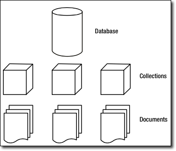

# Bases de Datos NoSQL 

No todos los datos encajan perfectamente en las estructuras rígidas de filas y columnas de las bases de datos relacionales (SQL) que conocemos. En el mundo del Big Data, los datos pueden ser **variados** (estructurados, semi-estructurados, no estructurados), masivos (**volumen**)y generados a gran **velocidad**. 

Aquí es donde entran en juego las bases de datos **NoSQL** (Not Only SQL), una categoría de sistemas de gestión de bases de datos que ofrecen una flexibilidad, escalabilidad y rendimiento excepcionales para estos escenarios.

En este tema, no solo exploraremos los fundamentos de NoSQL, sino que los aplicaremos a un caso de uso real y relevante: la plataforma **FIWARE** para la gestión de datos de Internet de las Cosas (IoT). Utilizaremos FIWARE para manejar los datos en tiempo real de los sensores de nuestro **Proyecto 1**, aprendiendo cómo esta plataforma se integra con distintas bases de datos NoSQL para gestionar el estado actual y el historial de los datos.

## 1. Introducción a NoSQL

Las bases de datos relacionales (SQL) son fantásticas para datos que se ajustan a un esquema fijo y tienen relaciones bien definidas (ej. un cliente tiene muchos pedidos). Sin embargo, cuando los datos son heterogéneos y cambian constantemente, como en una red de sensores IoT, las bases de datos NoSQL ofrecen una solución más ágil y eficiente.

**Ventajas de NoSQL:**

- **Flexibilidad de esquema:** No hay un esquema predefinido. Puedes almacenar diferentes tipos de datos dentro de la misma colección, lo cual es ideal para datos semi-estructurados como JSON.
- **Escalabilidad horizontal:** Las bases de datos NoSQL están diseñadas para escalar fácilmente en clústeres de servidores de bajo coste. Esto se conoce como escalabilidad horizontal y es crucial para manejar enormes volúmenes de datos.
- **Rendimiento:** Al estar diseñadas para casos de uso específicos, muchas bases de datos NoSQL ofrecen un rendimiento superior para lecturas y escrituras intensivas.


## 2. Tipos de Bases de Datos NoSQL

Cada tipo de base de datos NoSQL está optimizado para un propósito diferente. Entender sus características te ayudará a elegir la herramienta adecuada para cada tarea.

- **Bases de Datos de Documentos (Document Stores):**
    - **Concepto:** Almacenan datos en documentos similares a JSON (MongoDB usa BSON, una versión binaria de JSON). Cada documento puede tener un esquema diferente, lo que las hace increíblemente flexibles.
    - **Ejemplo:** **MongoDB**.
    - **Casos de uso:** Sistemas de gestión de contenidos, catálogos de productos y, en nuestro caso, el estado actual de las entidades de IoT.
- **Bases de Datos de Clave-Valor (Key-Value Stores):**
    - **Concepto:** El tipo más simple de NoSQL. Cada dato es un par **clave-valor**. Son extremadamente rápidas para operaciones de lectura y escritura.
    - **Ejemplos:** **Redis** (memoria), **DynamoDB** (Amazon).
    - **Casos de uso:** Caching de datos, gestión de sesiones de usuarios y tablas de búsqueda rápidas.
- **Bases de Datos Columnares (Wide-Column Stores):**
    - **Concepto:** En lugar de almacenar datos por filas, los almacenan por columnas. Esto las hace muy eficientes para consultas analíticas sobre grandes conjuntos de datos, ya que solo se leen las columnas necesarias.
    - **Ejemplo:** **Cassandra**.
    - **Casos de uso:** Analítica de Big Data, series de tiempo (Time Series) y bases de datos de eventos.
- **Bases de Datos de Grafos (Graph Databases):**
    - **Concepto:** Almacenan datos y las relaciones entre ellos en una estructura de grafo, donde los datos son **nodos** y las relaciones son **aristas**. Son ideales para analizar interconexiones complejas.
    - **Ejemplo:** **Neo4j**.
    - **Casos de uso:** Redes sociales, detección de fraude y sistemas de recomendación.

## 3. MongoDB

MongoDB es una base de datos NoSQL de tipo **documental**. A diferencia de las bases de datos relacionales que usan tablas, MongoDB organiza los datos en **colecciones**, que son equivalentes a las tablas, y cada colección contiene **documentos**, que son equivalentes a las filas.

La clave de MongoDB es que cada documento es una estructura flexible, similar a **JSON** (JavaScript Object Notation), que puede contener campos anidados, listas y otros documentos. Esto elimina la necesidad de un esquema fijo y hace que sea ideal para datos semi-estructurados.

### 3.1. Conceptos Clave:

- **Documento:** Un registro individual en MongoDB. Es una estructura de datos en formato **BSON** (una versión binaria de JSON), que puede tener diferentes campos y tipos de datos.
- **Colección:** Un grupo de documentos. Es el equivalente a una tabla en bases de datos relacionales. No se aplica un esquema estricto a los documentos de una colección.
- **Base de Datos:** Un contenedor físico para colecciones. Puedes tener múltiples bases de datos en una misma instancia de MongoDB.

{style="width:35%;margin:auto;display:block"}

#### 3.1.1. Documentos

El corazón de MongoDB es el documento, un conjunto ordenado de claves con valores asociados. Su representación como hemos nombrado en el tema anterior es en JSON, un formato muy intuitivo y que no pensamos que requiera mayor explicación. Este podría ser un ejemplo sencillo de un documento que guarda el nombre, apellidos y dedad de una persona. A la izquierda de los dos puntos el nombre del campo y a la derecha el valor.

``` json
  {
  nombre:"Jose Antonio",
  apellidos:"Guillem Benedito",
  edad:35
  }
```

Las claves de los documentos:

  - No pueden ser nulas.
  - No pueden contener los caracteres . (punto) y $ (dólar).
  - Puede contener cualquiera de los demás caracteres UTF-8 existentes.
  - Son case-sensitive (sensible a mayúsculas y minúsculas), por lo que las claves “nombre” y “Nombre” son diferentes, y por tanto consideradas como campos diferentes.
  - Las claves dentro de un mismo documento deben ser únicas, no pueden duplicarse. Así por ejemplo el siguiente documento no es válido por tener dos veces la clave nota.

``` json
  {
  nombre:"Jose Antonio",
  nota:8.9,
  nota:7.2 
  }
```

Cada documento en Mongo debe tener **obligatoriamente** un campo _id con valor único y que actuará como identificador único del documento. Es tan necesario este campo que cuando se guarda un documento sin especificarlo, Mongo automáticamente le asigna uno del tipo ObjectId.

#### 3.1.2. Colecciones 

Una colección es un grupo de documentos, es lo análogo a las tablas en el modelo relacional.
Las colecciones tienen esquemas dinámicos, lo que significa que los documentos dentro de una colección pueden tener múltiples “formas”. Por ejemplo, los siguientes documentos podrían guardarse en la misma colección, a pesar de tener diferentes campos, y diferentes tipos de datos.
``` json
  { nombre:"Jose Antonio", edad:35 }
  { username::"pepito", type:6, active:true }
``` 

Hay algunas restricciones respecto al nombre que una colección puede tener:

  - La cadena vacía (“”) no es un nombre válido.
  - Lo puede contener el carácter null.
  - No se pueden crear colecciones cuyo nombre empiece por “system.”, ya que es un prefijo reservado para colecciones internas.
  - No debe contener el carácter $ (dólar).

### 3.2. Operaciones básicas

#### 3.2.1. Inserción 

Para insertar un documento en una colección, utilice el método:
``` json
  db.alumno.insertOne({"name":"Antonio Cuenca"})
``` 

El comando ha añadido automáticamente el campo _id de tipo ObjectId, ya que como hemos explicado, todo documento debe tener un identificador único. Pero el uso del tipo ObjectId para el campo _id no es obligatorio, podemos utilizar cualquier valor, siempre y cuando garanticemos su unicidad. A continuación insertamos una nueva alumna, especificando que su _id es el número 10 (tipo Long).

``` json
  db.alumno.insertOne({_id:NumberLong(10), name:"Eva",apellidos:"Perez Garcia"})
```
Si queremos insertar múltiples documentos,podemos hacer la inserción más rápida utilizando batch inserts, que permiten insertar en bloque un array de documentos a la colección. Esto se consigue con solo pasar un array de objetos al comando insert.

``` json
  db.numerosprimos.insertOne(
  [{_id:2},{_id:3},{_id:5},{_id:7},{_id:11},{_id:13},{_id:17},{_id:19}] )
```
  
#### 3.2.2. Borrado 

Vaya con cuidado, eliminar colecciones completas es muy sencillo en Mongo. Esto borrará todo, tanto la colección como meta propiedades asociadas a ella o
índices creados sobre campos.
  db.alumno.drop()
Por otra parte, para eliminar solo documentos de una colección, tenemos el comando deleteOne, que recibe como parámetro el criterio de borrado en forma de documento JSON. En ese caso, solo los documentos que cumplen el criterio se eliminarán de la colección.
``` json
  db.numerosprimos.deleteOne( {id:23})
```

#### 3.2.3. Modificación 
Para modificar un documento se utiliza el método **update**. Este método recibe dos parámetros, el primero es el criterio de actualización, y el segundo el modificador, que describe los cambios que deben realizarse.

Esta es la lista de modificadores:

| Modificador | Acción |
| -- | -- |
| **$set** | Asigna el valor a un campo |
| **$unset** | Elimina cualquier campo de uno o varios documentos |
| **$inc** | Incrementar el valor numérico de una clave existente |
| **upsert** | Si no existe el documentoe lo crea |
| **multi** | Modifica multiples documentos |

Veamoslos:

**$set**

Asigna el valor a un campo. Si el campo todavía no existe en el documento lo creará. Se utiliza en el segundo parámetro que se le pasa al comando update.
``` json
    db.alumno.insertOne( { name:"Arturo", apellidos:"Leon Zapata" })
    db.alumno.update( {name:"Arturo"}, { $set: {edad:17} })
```

Podemos darle valor a varios campos a la vez, simplemente informando los pares clave:valor separados por coma. En este ejemplo damos valor a tres campos diferentes con un solo comando.
``` json
    db.alumno.update({name:"Arturo"},{$set:{nota:8.2,orden:12,actitud:"positiva"}})
```

**$unset**

Para eliminar cualquier campo de uno o varios documentos lo hacemos también con el comando update pero con el modificador $unset.

En MongoDB es habitual utilizar los valores 1 y -1 para indicar verdadero y falso respectivamente. En este caso, al especificar valor 1 estamos diciendo que la
clave entra dentro del conjunto de campos en los que queremos aplicar el $unset.

De esta forma, si queremos eliminar el campo "edad" del documento que guarda la información del alumno "Arturo", lo haríamos así.
``` json
    db.alumno.update({name:"Arturo"},{$unset:{edad:1}})
``` 

**$inc**

Este modificador puede utilizarse para incrementar o decrementar el valor numérico de una clave existente o para crear una nueva si no existe.
``` json
    db.alumno.update({name:"Arturo"},{$inc:{puntuacion:2}})
```

Otros operadores que podemos utilizar de forma similar son **$mul, $min, $max y $currentDate**.
``` json
    db.alumno.update({name:"Arturo"},{$min:{puntuacion:3}})
```

El ejemplo de arriba modifica la puntuación y le asigna un 3, si esta es mayor que 3. Tambien se puede leer como que le asinga el menor de los valores, el actual o el propuesto en la actualización.

**Upsert**

Un upsert es un tipo de update especial. Si no se encuentra ningún documento que haga matching con el criterio del update, entonces se creará un nuevo documento combinando el criterio y lo que se quiere actualizar. Si se encuentra un documento que haga matching se actualizará normalmente.
Para decirle a MongoDB que queremos hacer un upsert, solo hay que pasar al comando update un tercer parámetro, con valor true. Esto significa que el update se comportará como lo acabamos de explicar. 
``` json
    update({...},{...},true)
    db.alumno.update({name:"Sofia"},
                     {$set:{apellidos:"Alarcon Revilla"}},
                     {upsert:true})
```

**Multiples Documentos**

Para modificar múltiples documentos, en el tercer parámetro del update indicaremos {multi: true}. 
``` json
    db.books.update({lang:"en"},
                    {$inc: {price: 50.00}}, 
                    {multi:true})
```

### 3.3. Consultas 
El método **find** es el qué se utiliza para hacer queries en Mongo. Es el equivalente al comando select en el modelo relacional. Al consultar una colección, Mongo nos
devolverá un subconjunto de documentos, que variará desde el conjunto vació hasta la colección completa.

Find tiene varios parámetros de entrada, el primero de ellos especifica los documentos que queremos recuperar, esto es, el criterio de búsqueda.
``` json
    db.coleccion.find({ clave:valor })
```
La función anterior nos devolvería documentos de la colección coleccion cuyo campo clave tenga un valor igual a valor.

El valor por defecto para este primer parámetro es {}, que significa "cualquier documento". Por tanto una query como db.coleccion1.find({ }) devolverá todos los documentos de la colección coleccion1. Como es el valor por defecto para el criterio de la consulta es equivalente hacer find({ }) y find( ).
``` json
    db.alumno.find({edad:17})
    db.alumno.find({name:"Antonio"})
```

Igual que en SQL podemos especificar los campos que queremos recuperar (select campo1, campo2, campo3 from tabla ... ), podemos hacerlo también en Mongo. Para ello solo tenemos que pasar un segundo parámetro al método find, en el que decimos los que queremos.
``` json
    db.coleccion1.find({ },{ clave3:1, clave4:1 })
```
Los campos que queremos que sean devueltos les pondremos el valor 1. El campo _id siempre se devuelve. También podemos especificar los campos que no queremos que sean devueltos, en este caso como valor para cada una de esos campos, pondremos cero. El resultado será que se devolverán el resto de documentos.
``` json
    db.coleccion1.find({ },{ clave3:0, clave4:0 })
```
  
#### 3.3.1 Operadores de comparación 
MongoDB permite utilizar los siguientes operadores de comparación:

| Operador | Condición |
| -- | -- |
| **$lt** | < |
| **$lte** | <= |
| **$gt** | > |
| **$gte** | >= |
  
La sintaxis es:
``` json
  clave: { $operador: valor }
```
Así si por ejemplo queremos recuperar los libros con un precio mayor que 10 lo haríamos utilizando el operador **$gt** sobre el campo precio:
``` json
  db.libro.find({"precio":{$gt:10}},{titulo:1,precio:1})
``` 

#### 3.3.2. Operadores lógicos

| Operador | Acción                     | Sintaxis              |
| -------- | ---------------------------| ------------------------------------------- |
| **$in** | Recupera documentos cuyo campo clave esté entre alguno de los valores especificados en el array | clave:{$in:[valor1,valor2,valorN]} |
| **$nin** | Recupera documentos cuyo campo clave NO esté entre alguno de los valores especificados en el array | clave:{$nin:[valor1,valor2,valorN]} |
| **$or** | Con el siguiente find, vamos a recuperar aquellos documentos que estén en stock (enstock:false) o que tengan editorial (editorial:null). | $or:[{clave1:valor1},{clave2:valor2},{claveN:valorN}] |
| **$nor** | Con el siguiente find, vamos a recuperar aquellos documentos que no estén en stock (enstock:false) o que no tengan editorial (editorial:null). | $nor:[{clave1:valor1},{clave2:valor2},{claveN:valorN}] |
| **$not** | Es lo que se conoce como un metacondicional, que son opeadores que pueden aplicarse por encima de cualquier otro criterio. Su sintaxis es sencilla, solo hay que ponerlo “fuera” de aquello que queremos negar. | $not:{criterio} |
| **$exist** | Se utiliza para comprobar los documentos que tienen informado o no un campo determinado | clave:{$exists:boolean} |


**Ejemplos**

```json
db.libro.find({editorial:{$in:["Debolsillo","Planeta","Gigamesh"]}},
              {titulo:1,editorial:1}
             )
``` 
``` json
  db.libro.find({editorial:{$nin:["Debolsillo","Planeta","Gigamesh"]}},
                {titulo:1,editorial:1}
               )
``` 
``` json
  db.libro.find({$or:[{enstock:false},{editorial:null}]},
                {titulo:1,editorial:1,enstock:1}
               )
```
``` json
  db.libro.find({$nor:[{enstock:false},{editorial:null}]},
                {titulo:1,editorial:1,enstock:1}
               )
```
``` json
  db.libro.find( { paginas: {$not: { $eq:480 } } },
                 {titulo:1,paginas:1}
               )
```
``` json
  db.libro.find({paginas:{$exists:true}},{paginas:1})
```

!!! warning "null"
    Tiene un comportamiento un poco extraño, ya que hace matching en los siguientes casos:

    - Con valores que almacenan null, por ejemplo “y” : null
    - Con campos que no existen en un documento. Si por ejemplo el documento A no tiene informado el campo x, una búsqueda por { x:null } sí que se encontraría.

#### 3.3.3. Documentos embebidos 

Para hacer queries contra campos de documentos embebidos dentro de otros documentos, solamente hay que poner la “ruta” completa de claves separada por puntos. 

Es decir, si tenemos por ejemplo una estructura como esta para los libros.
``` json
  db.libro.save({
          "_id":"9788408117117",
          "titulo":"Circo Máximo",
          "autor": {
                    nombre:"Santiago",
                    apellidos:"Posteguillo Gómez",
                    nacimiento: {
                                 anyo:1967,
                                 ciudad:"Valencia"
                   }
          },
         "editorial":"Planeta",
         "enstock":true,
         "paginas":1100,
         "precio":21.75
  })
```

Podemos lanzar queries directamente contra los documentos embebidos, autor y nacimiento de esta forma.
``` json
  db.libro.findOne({"autor.nombre":"Santiago"})
```
  
El find anterior recuperará el primer documento donde el campo nombre, del campo autor sea “Santiago”.
``` json
  db.libro.findOne({"autor.nacimiento.anyo":{$gt:1965}})
```
El find anterior recuperará el primer documento donde el campo anyo, del campo nacimiento, del campo autor sea mayor que 1965.

### 3.4. Ejercicios Prácticos

Vamos a trabajar con dos colecciones:
[profesores](profesores.json){:target="_blank"} y [asignaturas](asignaturas.json){:target="_blank"}

Estas son las consultas propuestas:

**Insertar, Modificar y Borrar**

1. Listar todos los profesores  // db.profesores.find()
- Insertar un profesor y una asignatura en la colección
- Actualizar la asignatura del profesor que acabáis de insertar
- Borrar el profesor que se acaba de insertar
- Actualizar todas las edades de los profesores en una unidad
- Usar upsert para añadir un nuevo profesor con nombre “Aitor”, en caso de que no lo encuentre, añade un campo “Personal” con valor ”Fijo”

**Selectores de consultas**

1. Listar las asignaturas con 23 alumnos
- Listar las asignaturas con 23 alumnos o más
- Listar las asignaturas que imparte el profesor Juan
- Listar las asignaturas que NO imparte el profesor Juan
- Listar las asignaturas que imparten Juan o Laura 
- Listar las asignaturas que NO imparten ni Juan ni Laura 


Imagina que tienes una base de datos llamada `iot_data` para el Proyecto 1.

**Base de datos de sensores**

1. Crea una base de datos llamada `iot_data`.
2. Crea una colección llamada `dispositivos`.
3. Inserta un documento en la colección `dispositivos` con la siguiente información:
    - `id_sensor`: "temp01"
    - `tipo`: "temperatura"
    - `ubicacion`: "sala_servidores"
    - `valor_actual`: 24.5
    - `unidad`: "celsius"
4. Inserta dos nuevos documentos en la colección `dispositivos`: uno para un sensor de humedad (`hum01`) y otro para un sensor de CO2 (`co201`), con valores y ubicaciones que elijas.
5. Busca y muestra solo los documentos de los sensores de tipo "temperatura".
6. Actualiza el valor actual del sensor con `id_sensor: "temp01"` a 25.8.
7. Verifica que el valor se haya actualizado correctamente buscando el documento del sensor.
8. Elimina el documento del sensor de CO2 (`co201`) de la colección.
9. Verifica que el documento ya no exista.


## 4. FIWARE y MongoDB

**FIWARE** es una iniciativa de código abierto que proporciona un conjunto de estándares y componentes de software para acelerar el desarrollo de soluciones inteligentes en diversos dominios como Ciudades Inteligentes (Smart Cities), Industria Inteligente (Smart Industry) y Agricultura Inteligente (Smart Agrifood). Nos centraremos en su uso en las **Smart Cities**.

### 4.1. ¿Qué es una Smart City?

Una Smart City (ciudad inteligente) es una urbe que utiliza tecnologías digitales y de comunicación para mejorar la eficiencia de los servicios urbanos, optimizar el uso de los recursos y mejorar la calidad de vida de los ciudadanos. 

A través de sensores IoT, Big Data, inteligencia artificial y plataformas digitales, las Smart Cities pueden gestionar de manera inteligente infraestructuras como el tráfico, el alumbrado público, la gestión de residuos y la seguridad ciudadana.

### 4.2. Introducción a FIWARE y las Smart Cities

FIWARE es una plataforma de código abierto que proporciona componentes para desarrollar soluciones inteligentes, especialmente en el ámbito de las Smart Cities. Permite gestionar datos en tiempo real mediante una arquitectura basada en microservicios.

{style="width:80%;margin:auto;display:block"}


### 4.3. Arquitectura de FIWARE

FIWARE está compuesto por varios elementos clave:

- **Context Broker (Orion)**: Es el núcleo de FIWARE. Se encarga de la gestión del contexto de la ciudad, almacenando y proporcionando datos en tiempo real sobre las entidades urbanas. Permite la comunicación entre dispositivos IoT y aplicaciones a través de la API NGSI.
- **IoT Agents**: Son intermediarios entre los dispositivos IoT y el Context Broker. Actúan como traductores de protocolos, permitiendo la comunicación con sensores y actuadores a través de protocolos como MQTT, HTTP y LwM2M.
- **Cygnus**: Componente encargado de la persistencia de datos. Se integra con bases de datos y sistemas de almacenamiento como MySQL, PostgreSQL, MongoDB o Hadoop, asegurando la trazabilidad de la información.
- **Quantum Leap**: Servicio especializado en la gestión y análisis de datos históricos. Permite la consulta y visualización de series temporales mediante la integración con bases de datos como CrateDB.
- **Security & Identity Management (Keyrock, PEP Proxy, Wilma, Authzforce)**: Garantiza la autenticación y autorización de usuarios y dispositivos dentro de FIWARE.
- **Keyrock**: Proporciona gestión de identidades y autenticación basada en OAuth2.
- **PEP Proxy y Wilma**: Protegen las API asegurando que solo usuarios autorizados puedan acceder a los servicios.
- **Authzforce**: Proporciona control de acceso basado en políticas (ABAC).
- **NGSI-v2**: Es el  estándar de intercambio de datos en FIWARE basado en Linked Data, que permite la interoperabilidad entre diferentes sistemas dentro de una Smart City.
- **NGSI-LD**: Es el nuevo estándar de intercambio de datos en FIWARE basado en Linked Data.


*Fuente: [https://documenter.getpostman.com/view/513743/RWEnkvDc](https://documenter.getpostman.com/view/513743/RWEnkvDc)*

### 4.4 Orion Context Broker (OCB)

El componente central de cualquier solución basada en FIWARE es el **Orion Context Broker**. Su única función es gestionar todo el ciclo de vida de la información de contexto: recibir actualizaciones, procesar consultas y enviar notificaciones. Podemos pensar en él como una base de datos central en tiempo real que almacena el estado actual de todas las entidades. Por defecto, utiliza **MongoDB** para persistir esta información, ya que el modelo de documentos de MongoDB se adapta perfectamente a la naturaleza flexible y semi-estructurada de los datos de contexto (generalmente en formato JSON).

- El **Orion Context Broker (OCB)** es el **componente central de FIWARE**.
- Su función principal es **gestionar la información de contexto**, permitiendo que:
  - Los **productores** (sensores, aplicaciones, etc.) publiquen datos.
  - Los **consumidores** los consulten o se suscriban a cambios.
- Mantiene **el estado actual** de las entidades, **no el histórico** (para eso se usa otro componente).
- Utiliza **MongoDB** para almacenar la información.
- Opera mediante una **API RESTful** basada en **NGSI v2**.
- Por defecto, escucha en el puerto **1026**.
- Principio clave: **desacoplamiento** entre productores y consumidores.

### 4.5. Modelo de datos: NGSI / Entidades de contexto

El modelo de datos sobre el que se construye todo este ecosistema es el NGSI v2. En él, cada entidad de contexto representa un elemento relevante del sistema, **una entidad de contexto**. 

Cada entidad tiene:

  - `id`: identificador único.
  - `type`: tipo de entidad.
  - **Atributos**: cada uno con `value` y `type`.
  - (Opcional) metadatos adicionales.

#### Ejemplo de entidad:

```
{
  "id": "Room1",
  "type": "Room",
  "temperature": {
    "value": 23,
    "type": "Float"
  },
  "pressure": {
    "value": 720,
    "type": "Integer"
  }
}
```

#### Operaciones básicas de la API NGSI v2

| Operación                      | Método / Ruta                                  | Descripción                               | Ejemplo                                            |
| ------------------------------ | ---------------------------------------------- | ----------------------------------------- | -------------------------------------------------- |
| Comprobar versión              | `GET /version`                                 | Ver versión del broker                    | —                                                  |
| Crear entidad                  | `POST /v2/entities`                            | Crea una nueva entidad                    | Crear `Room1` con temperatura y presión            |
| Consultar entidad              | `GET /v2/entities/{id}`                        | Obtiene los atributos de una entidad      | `GET /v2/entities/Room1`                           |
| Consultar varias entidades     | `GET /v2/entities` + filtros                   | Recupera varias entidades con condiciones | `GET /v2/entities?type=Room` o `?q=temperature>22` |
| Actualizar atributos (parcial) | `PATCH /v2/entities/{id}/attrs`                | Cambia valores de uno o varios atributos  | Cambiar temperatura de `Room1`                     |
| Reemplazar todos los atributos | `PUT /v2/entities/{id}/attrs`                  | Sustituye los atributos existentes        | —                                                  |
| Actualizar un solo valor       | `PUT /v2/entities/{id}/attrs/{attrName}/value` | Modifica solo un valor                    | Cambiar `temperature` de `Room1`                   |
| Crear suscripción              | `POST /v2/subscriptions`                       | Suscribirse a cambios en entidades        | Ejemplo abajo                                      |
| Consultar suscripciones        | `GET /v2/subscriptions`                        | Ver las suscripciones existentes          | —                                                  |
| Actualizar suscripción         | `PATCH /v2/subscriptions/{subId}`              | Modificar condiciones o expiración        | —                                                  |
| Eliminar suscripción           | `DELETE /v2/subscriptions/{subId}`             | Cancelar suscripción                      | —                                                  |

------

#### Suscripciones y notificaciones

- Permiten que los consumidores reciban **notificaciones automáticas** cuando cambian ciertos datos.
- Se crean con `POST /v2/subscriptions`.
- Se definen los siguientes campos:
  - `description`: texto descriptivo.
  - `subject`: entidades y atributos a monitorear.
  - `condition`: qué cambios activan la notificación.
  - `notification`: qué atributos enviar y a qué URL.
  - `expires`: fecha de expiración.
  - `throttling`: tiempo mínimo entre notificaciones (para evitar spam).

**Ejemplo de suscripción:**

``` json
{
  "description": "Suscripción para monitorear Room1",
  "subject": {
    "entities": [            # Lista de entidades a monitorear
      { "id": "Room1", 
        "type": "Room" }
    ],
    "condition": {
      "attrs": ["pressure"]   # Que dato/s debe cambiar para enviar la notificación
    }
  },
  "notification": {
    "attrs": ["temperature"],   # Que datos envia la notificación
    "http": { "url": "http://quantumleap:8668/v2/notify" }
  },
  "expires": "2040-01-01T14:00:00.00Z",    # Cuando caduca la suscripción
  "throttling": 5       # Intervalo minimo entre notificaciones
}
```

- Monitorea `Room1` del tipo `Room`.
- Se activa cuando cambia el atributo `pressure`.
- Envía una notificación HTTP POST al endpoint configurado con el valor de `temperature`.
- Envía notificaciones cada mínimo **5 segundos**.

**Ejemplo de notificación enviada:**

```
{
  "data": [
    {
      "id": "Room1",
      "temperature": {
        "metadata": {},
        "type": "Float",
        "value": 28.5
      },
      "type": "Room"
    }
  ],
  "subscriptionId": "57458eb60962ef754e7c0998"
}
```

- El campo `subscriptionId` identifica la suscripción activa.
- Se puede **pausar o reactivar** una suscripción con `PATCH`.
- Se pueden personalizar:
  - El formato (`attrsFormat`)
  - El verbo HTTP (POST, PUT)
  - Las condiciones de activación
  - Incluir el valor anterior de los atributos

### 4.6. Integración de FIWARE con Bases de Datos NoSQL en Nuestro Proyecto

En nuestro proyecto, la arquitectura de FIWARE se materializa de la siguiente manera:

- **Orion Context Broker y MongoDB:** Orion gestiona el **estado actual** de nuestras entidades (sensores). Cada vez que un sensor envía un nuevo valor, Orion actualiza el documento correspondiente en su base de datos interna, que es **MongoDB**. Esto nos da una visión en tiempo real del sistema.

- **QuantumLeap y CrateDB/TimescaleDB:** El Orion Context Broker por sí solo no guarda un historial. Para almacenar cada una de las 400 actualizaciones que enviaremos, utilizamos una **suscripción**. Esta suscripción le dice a Orion que, cada vez que reciba una actualización para una de nuestras entidades, debe notificar a otro componente: **QuantumLeap**. QuantumLeap, a su vez, toma esta notificación y la persiste en una base de datos optimizada para series temporales, como **CrateDB** o **TimescaleDB**.

/// html | div[style='text-align: center;']   

///

Esta arquitectura dual es extremadamente potente:

-   **MongoDB** nos da acceso instantáneo y eficiente al **estado más reciente**.
-   **CrateDB/TimescaleDB** nos proporciona un **historial completo** para análisis, visualización de tendencias y auditoría.

FIWARE es un marco de software de código abierto que facilita el desarrollo de aplicaciones inteligentes. Su componente central para la gestión de datos es el **Orion Context Broker**.

**El Rol del Orion Context Broker como Gestor de Estado**

Imagina que el **Orion Context Broker** es el "cerebro" de nuestro sistema IoT. Su función principal es gestionar el **estado en tiempo real** de las entidades de nuestro proyecto (ej. sensores). Cuando un sensor envía datos, Orion recibe la información y la actualiza en su base de datos interna. Esta base de datos, por defecto, suele ser **MongoDB**.

## 5. Práctica

### Smart City - Tarea 2: Construcción infraestructura FIWARE

Vamos a construir una solución completa de gestión de datos de IoT.

1. **Configuración del entorno FIWARE:**
    - Utilizaremos **Docker Compose** para levantar los servicios necesarios:
        - `orion`: El Orion Context Broker.
        - `mongo`: La base de datos MongoDB para el estado actual.
        - `quantumleap`: El componente para el histórico.
        - `cratedb`: La base de datos para el histórico de datos.
    - Asegúrate de que todos los contenedores se comuniquen correctamente a través de la red de Docker.
2. **Creación de las 3 entidades:**
    - Usando la **API REST de Orion Context Broker**, crearemos las 3 entidades que definimos en la *Tarea 1: Diseño del ADN de los Sensores*.
    - La llamada API enviará un `POST` a `/v2/entities` con el JSON de cada entidad.
3. **Creación de una suscripción:**
    - Esta es la parte clave para el histórico. Crearemos una **suscripción** en Orion que "escucha" cualquier cambio en nuestras entidades.
    - Cuando Orion detecte una actualización, enviará automáticamente una copia de la entidad modificada al servicio **QuantumLeap**.
    - La suscripción se crea con un `POST` a `/v2/subscriptions`.
4. **Carga de datos:**
    - Ahora viene la carga de los datos masivos. Utilizaremos un script de Python con la API de Orion.
    - El script deberá **enviar 400 actualizaciones por atributo** a la API de Orion para cada una de nuestras 3 entidades.
    - Cada vez que el script envíe una actualización, Orion hará dos cosas:
        - Actualizará el documento en **MongoDB** con el nuevo estado.
        - Debido a la suscripción, enviará una copia de los datos a **QuantumLeap**, que a su vez los insertará en **CrateDB** como una nueva entrada de serie de tiempo.
5. **Consulta Mongodb**
    - Realiza una captura de pantalla con la consulta Mongodb a la coleccion de entidades en la que se vean todos los atributos de las tres entidades
6. **Guarda** toda la información en tu Repositorio de GitHub
   
Al final de la práctica, tendrás un sistema funcional donde puedes ver el estado actual de tus entidades en MongoDB y consultar el historial completo en CrateDB.

**Ayudas**

- [Mi primera aplicación con FIWARE](https://fiware-training.readthedocs.io/es-mx/latest/casodeestudio/descripcion/){target:_blank}
- [Orion Context Broker](https://fiware-training.readthedocs.io/es-mx/latest/ecosistemaFIWARE/ocb/){target:_blank}
