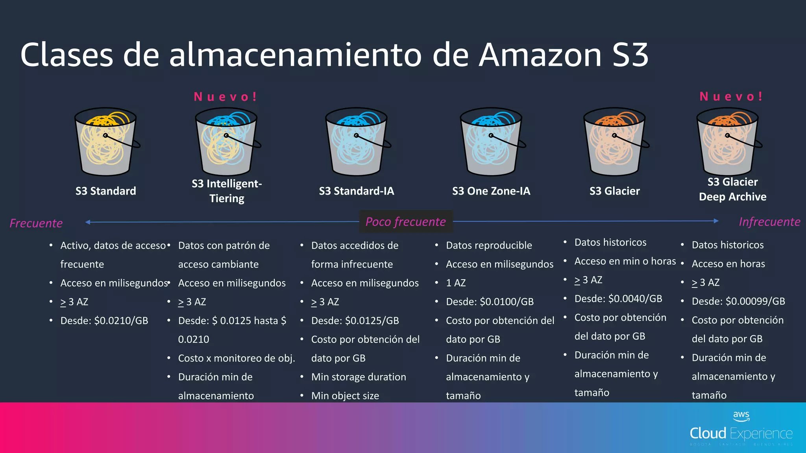

# Almacenamiento Moderno: Data Lake & Data Warehouse

En este tema vamos a aprender a construir el "almacén" donde guardaremos todos los datos durante elproyecto de Big Data La forma en que almacenamos los datos es una de las decisiones de arquitectura más críticas que tomaremos. Una buena estrategia de almacenamiento garantiza que nuestras consultas sean rápidas, que nuestros sistemas sean escalables y que nuestros costes se mantengan bajo control.

En este módulo, exploraremos los tres grandes paradigmas de almacenamiento: el tradicional **Data Warehouse**, el flexible **Data Lake** y la moderna arquitectura híbrida, el **Data Lakehouse**. También descubriremos por qué el formato de fichero que elegimos (como **Parquet**) puede tener un impacto drástico en el rendimiento. Finalmente, pondremos toda esta teoría en práctica diseñando el corazón de nuestro proyecto de análisis académico: un Data Warehouse con esquema en estrella.

## 1. Paradigmas de Almacenamiento: 

**¿Biblioteca, Lago o Ambos?** 

La elección de la arquitectura de almacenamiento depende del tipo de datos que tenemos y, sobre todo, de lo que queremos hacer con ellos.

### 1.1. El Data Warehouse (DWH): La Biblioteca Especializada

Imagina una gran biblioteca universitaria. Los libros (datos) no se aceptan de cualquier manera. Pasan por un riguroso proceso de selección, catalogación y clasificación antes de ser colocados en estanterías específicas. Todo está perfectamente ordenado y estructurado para que un investigador (un analista de negocio) pueda encontrar la información que necesita para su tesis (un informe de BI) de la forma más rápida y fiable posible.

- **Concepto Clave:** 
    - El DHW es un repositorio central de datos **integrados, depurados y estructurados**, optimizado para el análisis y la generación de informes (Business Intelligence).
- **Schema-on-Write (Estructura al Escribir):** 
    - La característica que lo define. Antes de que un solo dato entre en el DWH, debemos haber definido una estructura rígida (tablas, columnas, tipos de datos). Si los datos no cumplen con esa estructura, son rechazados o deben ser transformados.
- **Contenido:** 
    - Solo contiene la "joya de la corona": datos limpios, transformados y agregados que han sido validados. Es la **fuente única de la verdad (Single Source of Truth)** para la toma de decisiones estratégicas.
- **Uso Principal:** 
    - Consultas SQL complejas, informes de BI (como los que haremos con Power BI) y cuadros de mando para la dirección.
- **Metodologías de Diseño:**
    - **Inmon (Top-down):** Propone construir un gran DWH corporativo centralizado y, a partir de él, crear pequeños subconjuntos de datos llamados *Data Marts* para cada departamento.
    - **Kimball (Bottom-up):** Propone un enfoque más ágil. Se construyen primero los *Data Marts* enfocados en procesos de negocio específicos (ventas, finanzas, etc.) y luego se unen para formar un DWH consolidado. **Para nuestro Proyecto 2, seguiremos la filosofía de Kimball**, ya que diseñaremos un Data Mart específico para el análisis de resultados académicos.

#### 1.1.1. Herramientas Populares para Data Warehouses

- Amazon Redshift (AWS): Solución en la nube con alta escalabilidad y rendimiento.
- Google BigQuery (Google Cloud): Plataforma de análisis rápido con integración nativa en Google Cloud.
- Azure Synapse Analytics (Microsoft): Combina data warehousing con análisis de grandes volúmenes de datos.
- Snowflake: Plataforma de data warehouse en la nube que facilita el escalado y la gestión de datos.
- Teradata y Oracle Data Warehouse: Soluciones tradicionales con un amplio soporte para grandes organizaciones.

#### 1.1.2. Ejemplo de **Data Warehouse (DWH)**

Imagina una **gran cadena de supermercados** como Mercadona o Carrefour.

- Fuentes de Datos:
    - **Sistemas de Venta (TPV):** Cada ticket de compra (qué productos, a qué precio, en qué tienda, a qué hora).
    - **Sistema de Inventario:** Stock de productos en cada almacén y tienda.
    - **CRM (Gestión de Clientes):** Datos de los clientes con tarjeta de fidelidad.
- Proceso (ETL - Extract, Transform, Load):
    1. **Extracción:** Cada noche, se extraen los datos de ventas, inventario y clientes de las últimas 24 horas.
    2. **Transformación:** Los datos se limpian (ej. se corrigen nombres de productos), se unifican (ej. se asocia cada venta a un cliente) y se agregan (ej. se calcula el total de ventas por producto y día).
    3. **Carga:** Los datos ya limpios y agregados se cargan en el Data Warehouse, que tiene una estructura de **esquema en estrella** muy definida.
- Estructura y Uso:
    - **Tabla de Hechos:** `Ventas_Diarias` con métricas como `total_euros`, `unidades_vendidas`.
    - **Dimensiones:** `Dim_Producto`, `Dim_Tienda`, `Dim_Cliente`, `Dim_Tiempo`.
    - **Caso de Uso:** Un analista de negocio quiere saber: "¿Cuál fue el producto más vendido en la provincia de Valencia durante el último trimestre?". Ejecuta una consulta SQL que une la tabla de hechos con las dimensiones. La consulta es muy rápida porque los datos ya están estructurados y pre-calculados para este tipo de preguntas. El resultado se visualiza en un informe de Power BI para la dirección.

### 1.2. El Data Lake: El Lago Natural

Ahora imagina un gran lago natural. Varios ríos (fuentes de datos) desembocan en él, arrastrando todo tipo de elementos: agua clara, barro, troncos, peces, plantas (datos estructurados, semi-estructurados y no estructurados). El lago lo acepta y lo almacena todo en su estado original, sin filtros.

- **Concepto Clave:** 
    - Es un repositorio de almacenamiento masivo que guarda enormes cantidades de **datos en su formato nativo y crudo**.
- **Schema-on-Read (Estructura al Leer):** 
    - La filosofía opuesta al DWH. No se define ninguna estructura al guardar los datos. La responsabilidad de interpretar y dar forma a los datos recae en el analista o científico de datos en el momento en que los va a utilizar.
- **Contenido:** 
    - ¡De todo! Desde tablas de bases de datos y CSVs hasta logs de servidores, imágenes, vídeos, clics de una web o datos de sensores de IoT. Nada se descarta.
- **Uso Principal:** 
    - Exploración de datos, análisis predictivo y Machine Learning, donde los científicos de datos necesitan acceso a los datos originales y sin procesar para descubrir patrones ocultos.
- **El Gran Reto:** 
    - Si no se gestiona adecuadamente con metadatos y un catálogo, un Data Lake puede convertirse rápidamente en un **Data Swamp (Ciénaga de Datos)**: un repositorio caótico y sin documentar donde es imposible encontrar nada de valor.

#### 1.2.1. Herramientas populares para Data Lake

- Amazon S3 (AWS): Amplia integración con servicios en la nube de Amazon.
- Azure Data Lake (Microsoft): Ofrece almacenamiento escalable y servicios de análisis.
- Google Cloud Storage: Integración con herramientas de análisis de Google.
- Apache Hadoop: Sistema de almacenamiento distribuido para grandes volúmenes de datos.

#### 1.2.2. Ejemplo de **Data Lake**

Piensa en un **coche autónomo moderno** (como un Tesla).

- Fuentes de Datos (¡Todo en crudo!):
    - **Sensores del coche:** Vídeo de las cámaras (GB por minuto), datos del radar y LiDAR (nubes de puntos 3D), lecturas del GPS, velocidad, aceleración.
    - **Interacciones del conductor:** Cuándo toma el control, a qué botones pulsa.
    - **Logs del sistema:** Ficheros de texto con información de errores y rendimiento del software del coche.
- Proceso (Almacenamiento Directo):
    - Todos estos datos (vídeos, JSON, texto, datos binarios) se transmiten y se vuelcan **directamente y sin transformar** a un sistema de almacenamiento masivo en la nube (como Amazon S3 o Google Cloud Storage). No hay una estructura previa.
- Estructura y Uso:
    - Los datos se organizan en carpetas, normalmente por fecha, hora y tipo de dato (ej. `/datos_coche/2025-09-17/14-00/camara_frontal/video.mp4`).
    - Caso de Uso: Un ingeniero de Machine Learning quiere mejorar el algoritmo de detección de peatones.
        1. Accede al Data Lake y busca miles de horas de vídeo de las cámaras frontales.
        2. Utiliza un clúster de computación (como Spark) para procesar estos vídeos en paralelo.
        3. Entrena un modelo de inteligencia artificial para que aprenda a identificar peatones en diferentes condiciones de luz y clima. Necesita los datos de vídeo en su formato original y sin procesar para que el modelo sea preciso.

### 1.3. El Data Lakehouse: Lo Mejor de Ambos Mundos

¿Y si pudiéramos tener la escala y flexibilidad del lago, pero con la fiabilidad y el orden de la biblioteca? Esa es la promesa del Data Lakehouse. Es la arquitectura que está dominando el ecosistema de datos moderno.

- **Concepto Clave:** 
    - Es una nueva arquitectura que implementa funcionalidades de gestión y estructura propias de un Data Warehouse directamente sobre el almacenamiento de bajo coste de un Data Lake.
- **Cómo Funciona:** 
    - Se basa en una capa de metadatos y un formato de tabla de código abierto (como Delta Lake, Apache Iceberg o Apache Hudi) que se coloca "encima" de los ficheros de datos (como Parquet) en el Data Lake. Esta capa añade capacidades cruciales.
- **Superpoderes que aporta:**
    - **Transacciones ACID:** Garantiza que las operaciones sobre los datos sean fiables (o se completan todas, o no se completa ninguna), evitando la corrupción de datos.
    - **Time Travel (Viaje en el Tiempo):** Permite consultar el estado de una tabla en un punto exacto del pasado, lo que es increíble para la auditoría y la depuración.
    - **Rendimiento Optimizado:** Combina el poder del almacenamiento columnar con técnicas de indexación y caching para lograr velocidades de consulta similares a las de un DWH.
    - **Unifica el BI y el Machine Learning:** Los analistas de BI pueden ejecutar sus informes sobre datos fiables y actualizados, mientras que los científicos de datos pueden trabajar con los mismos datos para entrenar sus modelos.

#### 1.3.1. Herramientas Populares para Data Lakehouse

- Databricks Lakehouse Platform: Considerada la plataforma pionera, unifica el almacenamiento de datos con el procesamiento a gran escala usando Apache Spark y Delta Lake.
- Snowflake: Una plataforma de datos en la nube que permite construir un Data Lakehouse combinando su potente motor de consultas con almacenamiento en la nube.
- Google BigQuery + Google Cloud Storage: Utiliza BigQuery para analizar datos directamente sobre Google Cloud Storage, actuando como una capa de consulta inteligente sobre el Data Lake.
- Azure Synapse Analytics: La solución de Microsoft que integra Data Warehousing, Big Data y Data Lakehouse en un único servicio.
- Amazon Redshift Spectrum + Amazon S3: Permite a Amazon Redshift ejecutar consultas SQL directamente sobre los datos almacenados en Amazon S3, combinando el Data Warehouse con el Data Lake.
- Dremio: Una plataforma que se autodenomina "el motor de SQL para Data Lake", enfocada en acelerar las consultas directamente sobre el almacenamiento del lago de datos.

#### 1.3.2. Ejemplo de **Data Lakehouse**

Una **plataforma de streaming de música** como Spotify es un caso de uso perfecto.

- **Arquitectura:** Utilizan una plataforma como Databricks o Snowflake sobre un Data Lake en la nube (AWS S3, Azure Data Lake Storage).
- Fuentes de Datos:
    - **Streaming en tiempo real:** Millones de eventos por segundo de los usuarios (qué canción escuchan, si le dan a "like", si saltan a la siguiente, qué buscan).
    - **Datos de catálogo:** Metadatos de las canciones, artistas, álbumes.
- Proceso y Estructura (Arquitectura Medallón: Bronce, Plata, Oro):
    1. **Capa Bronce (Datos Crudos):** Los eventos de streaming llegan en formato JSON y se guardan en una tabla Delta Lake casi sin tocar. Esto proporciona un histórico completo y auditable.
    2. **Capa Plata (Datos Limpios y Enriquecidos):** Se leen los datos de la capa Bronce, se limpian (ej. se filtran eventos de bots), se enriquecen (ej. se une el ID de la canción con su nombre y artista) y se guardan en otra tabla Delta Lake. Esta tabla ya tiene una estructura fiable y soporta **transacciones ACID**.
    3. **Capa Oro (Datos Agregados para Negocio):** Se leen los datos de la capa Plata y se crean tablas agregadas con métricas clave: `oyentes_activos_diarios`, `canciones_mas_populares_por_pais`, etc.
- Casos de Uso Unificados:
    - **Analista de BI:** Conecta Power BI a las **tablas de Oro** para crear un dashboard que muestra el crecimiento de usuarios en tiempo real. La consulta es rápida y los datos son fiables.
    - **Científico de Datos:** Utiliza los datos de la **tabla de Plata** para entrenar el motor de recomendación ("Descubrimiento Semanal"). Puede usar la función "Time Travel" de Delta Lake para reproducir los datos exactos que se usaron para entrenar una versión anterior del modelo y comparar resultados.
    - Ambos roles trabajan sobre la **misma copia de los datos** en el mismo sistema, eliminando la necesidad de duplicar información y asegurando la consistencia.

### 1.4 Almacenamiento S3 en AWS

Amazon Simple Storage Service (Amazon S3) es un servicio de almacenamiento en la nube escalable y duradero que permite almacenar y recuperar datos en cualquier momento desde cualquier ubicación en la web. Amazon S3 es ampliamente utilizado para el almacenamiento de objetos, copias de seguridad, distribución de contenido y como componente central de muchas aplicaciones en la nube.

#### 1.4.1. Conceptos de S3

- **Buckets**: Un bucket de Amazon S3 es un contenedor para almacenar objetos. Los objetos se almacenan en buckets y deben tener un nombre único en todo Amazon S3.
- **Objetos**: Los objetos son unidades de datos que se almacenan en buckets. Un objeto puede ser cualquier tipo de archivo, como documentos, imágenes, videos y más.
- **Regiones**: Amazon S3 está disponible en múltiples regiones de todo el mundo. Puedes seleccionar la región que mejor se adapte a tus necesidades de rendimiento y cumplimiento.
- **Clases de Almacenamiento**: Amazon S3 ofrece diversas clases de almacenamiento, como S3 Standard, S3 Intelligent-Tiering, S3 Glacier, S3 Glacier Deep Archive, entre otras, cada una diseñada para diferentes casos de uso y costos.
- **Control de Acceso**: Puedes definir políticas de control de acceso para determinar quién puede acceder y qué acciones pueden realizar en tus buckets y objetos.

#### 1.4.2. Configuración y Uso Básico de Amazon S3

- **Creación de un Bucket**: Desde la Consola de AWS, puedes crear un nuevo bucket y seleccionar su región. 
- **Carga de Objetos**: Puedes cargar objetos en tu bucket utilizando la Consola de AWS, la AWS CLI o SDKs.
- **Acceso a Objetos**: Puedes configurar permisos de acceso a objetos para definir quién puede ver y descargar los objetos.
- **Versiones de Objetos**: Amazon S3 admite versiones de objetos, lo que permite mantener un historial de cambios en los objetos.
- **Almacenamiento de Datos**:Utiliza las clases de almacenamiento adecuadas según tus requisitos de rendimiento y costo.

#### 1.4.4. Clases de almacenamiento S3 en AWS

{: style="width:100%;margin:auto;display:block"}

### 1.5 Prácticas
  
- [Práctica 1](#analisis-academico-tarea-2-arquitectura-de-data-lakehouse)
- [Práctica 2](#analisis-academico-tarea-3-diseno-del-data-warehouse)

## 2. Formatos de Fichero Optimizados: El Secreto de la Velocidad

Guardar los datos en un CSV es fácil, pero terriblemente ineficiente para Big Data. La elección del formato de fichero es clave.

**Formatos de archivos más comunes en Big Data**

| Formato | Descripcion | Usos más comunes |
|--|--|--|
| **Avro** | Avro es un formato de datos que se utiliza para la serialización de datos y es compatible con múltiples lenguajes de programación. Es eficiente, compacto, esquemático y permite la evolución de esquemas de datos. | Avro se utiliza en sistemas de registro y en la comunicación entre componentes de Big Data. |
| **Parquet** | Parquet es un formato de columna abierto que se utiliza para el almacenamiento eficiente de datos estructurados y semiestructurados. Ofrece compresión eficiente y procesamiento de columnas, lo que lo hace adecuado para análisis de Big Data. | Parquet se utiliza en aplicaciones de análisis de datos, como Apache Hive y Apache Impala. |
| **ORC** | ORC (Optimized Row Columnar) es un formato de archivo de columna optimizado para la eficiencia en el almacenamiento y procesamiento de datos. Se compara favorablemente con Parquet y Avro en términos de eficiencia y velocidad de consulta. | ORC se utiliza en sistemas como Apache Hive y proporciona un rendimiento eficiente en consultas analíticas. |
| **Sequence** | Los archivos Sequence almacenan datos en un formato de secuencia binaria y son adecuados para la entrada y salida de datos de alto rendimiento.  | Se utilizan para almacenar registros y datos de flujo. |

### 2.1. Almacenamiento por Filas vs. por Columnas

Esta es la diferencia fundamental.

- **Basado en Filas (CSV, Avro):** Los datos de un mismo registro se guardan juntos en el disco. Es como leer un libro línea por línea.
    - **Ideal para:** Cargas transaccionales donde necesitas escribir o leer **un registro completo** rápidamente (ej. "dame toda la información del alumno con ID=50").
- **Basado en Columnas (Parquet, ORC):** Todos los datos de una misma columna se guardan juntos en el disco. Es como leer solo el primer capítulo de todos los libros de una estantería.
    - **Ideal para:** Cargas analíticas donde tus consultas solo implican **unas pocas columnas** de una tabla con muchas (ej. "calcula la media de las notas de todos los alumnos"). El sistema solo lee los datos de la columna "nota", ignorando el resto, lo que es increíblemente rápido.

**Comparativa**

|Almacenamieto|En Filas|En Columnas|
|--|--|--|
|Descripcion|Cada fila representa una entidad o un registro completo.|En operaciones de lectura/escritura de registros completos.|Cada columna contiene un tipo específico de dato.|
|Eficiente|Para operaciones de actualización frecuente de registros individuales.|Para operaciones de agregación y análisis de datos, como consultas OLAP y análisis de datos grandes.|
|No Eficiente|Para operaciones de agregación y análisis de datos que implican múltiples columnas|Para operaciones de actualización frecuente de registros individuales.|
|Adecuado|Para bases de datos transaccionales y aplicaciones que requieren actualizaciones frecuentes.|Para bases de datos analíticas y almacenes de datos (Data Warehouses).|
|Ejemplo|BD Relacionales tradicionales.|BD Analíticas columnares, como Apache Cassandra o Apache HBase.|

**Comparativa con un ejemplo.**

Si tenemos la siguiente tabla:

|Name|City|Age|
|--|--|--|
|Matt|LosAngeles|27|
|Dave|SanFrancisco|30|
|Tin|Oakland|33|

En un almacenamiento por Filas los datos se guardan asi:

||||||||||
|--|--|--|--|--|--|--|--|--|
|Matt|LosAngeles|27|Dave|SanFrancisco|30|Tin|Oakland|33|

En una almacenamiento por Columnas sería así:

||||||||||
|--|--|--|--|--|--|--|--|--|
|Matt|Dave|Tin|Oakland|Los Angeles|San Francisco|27|30|33|

[Mas info](https://dataschool.com/data-modeling-101/row-vs-column-oriented-databases/){:target="_blank"}

### 2.2. Apache Parquet: El Estándar de Oro

**Parquet** es un formato de fichero de código abierto, basado en columnas, que se ha convertido en el estándar de facto en el ecosistema Big Data.

- **Rendimiento Superior:** Al ser columnar, las consultas analíticas son órdenes de magnitud más rápidas.
- **Alta Compresión:** Agrupar datos del mismo tipo permite aplicar algoritmos de compresión muy eficientes, reduciendo drásticamente el espacio de almacenamiento (y por tanto, el coste).
- **Esquema Integrado:** El propio fichero Parquet almacena la información sobre la estructura de los datos (nombres de columnas, tipos de datos). Es auto-documentado.

### 2.3 Práctica
  
- [Práctica 3](#analisis-academico-tarea-4-de-csv-a-parquet-con-python-y-pandas)
  
## 3. Gobernanza y Calidad del Dato: Poniendo Orden

Tener una arquitectura de almacenamiento potente y formatos de fichero eficientes es solo la mitad de la batalla. Sin un conjunto de reglas, procesos y controles, nuestro brillante Data Lake puede convertirse rápidamente en una "ciénaga de datos" (Data Swamp): un lugar caótico, poco fiable y, en última- instancia, inútil. Esta sección trata sobre cómo pasar de la anarquía de datos a una gestión estratégica que genere confianza y valor.

### 3.1. Data Governance (Gobernanza de Datos): El Gobierno de Nuestros Datos

La gobernanza de datos es el marco general; el conjunto de políticas, roles, estándares y procesos que garantizan que los datos de una organización se gestionan como un **activo estratégico**.

**Analogía:** Piensa en el gobierno de una ciudad. El gobierno no construye cada casa, pero establece el plan urbanístico, los códigos de construcción y las normativas (quién puede construir, dónde y cómo) para asegurar que la ciudad crezca de forma ordenada, segura y funcional. De la misma manera, la gobernanza de datos establece las "leyes" para que los datos sean fiables y valiosos.

Sus pilares fundamentales son:

- **Propiedad y Responsabilidad (Ownership & Stewardship):** Asigna responsabilidades claras. ¿Quién es el "dueño" de los datos de los clientes? ¿Quién es responsable de asegurar la calidad de los datos de ventas?
- **Políticas y Estándares:** Define reglas consistentes sobre cómo nombrar, definir, almacenar y clasificar los datos (ej. "todos los ficheros de clientes deben contener una columna `id_cliente` de tipo texto").
- **Seguridad y Privacidad:** Controla quién puede acceder a qué datos y bajo qué condiciones, asegurando el cumplimiento de normativas como el GDPR.

### 3.2. Data Quality Management (Gestión de la Calidad del Dato)

La gestión de la calidad es la implementación práctica de las políticas de gobernanza para asegurar que los datos son **aptos para su uso**. No es una tarea que se hace una sola vez, sino un proceso continuo de medición, monitorización y mejora.

Las dimensiones clave de la calidad de un dato son:

- **Precisión (Accuracy):** ¿El dato refleja correctamente el objeto o evento del mundo real? *Ej: ¿La dirección de envío de un cliente en la base de datos es realmente donde vive?*
- **Completitud (Completeness):** ¿Tenemos todos los datos que necesitamos? ¿Faltan valores en campos importantes? *Ej: Un registro de producto sin precio o sin stock.*
- **Consistencia (Consistency):** ¿El mismo dato es coherente a través de diferentes sistemas? *Ej: El cliente aparece como "CIFP Mislata" en el sistema de facturación y como "Centro Integrado Público de Formación Profesional Mislata" en el CRM.*
- **Validez (Validity):** ¿El dato se ajusta a los formatos y reglas definidos? *Ej: Un campo `codigo_postal` que contiene texto en lugar de 5 dígitos numéricos.*
- **Puntualidad/Actualidad (Timeliness):** ¿El dato está disponible y actualizado cuando se necesita? *Ej: Un informe de ventas que se genera con datos de hace un mes tiene poca utilidad para tomar decisiones diarias.*

### 3.3. Componentes Clave para una Gobernanza Activa

Para que la gobernanza no sea solo un documento teórico, se apoya en herramientas prácticas que la hacen tangible y operativa.

#### 3.3.1. Catálogo de Datos (Data Catalog)

Un catálogo de datos es una herramienta centralizada que crea un inventario de todos los activos de datos de una organización. No almacena los datos en sí, sino los **metadatos** (los datos sobre los datos).

- **Analogía:** No es la biblioteca (el Data Lake), sino el **fichero de fichas o el buscador online de la biblioteca**. Te permite buscar un libro (un dataset), te dice en qué estantería está (su ubicación), de qué trata (descripción de columnas), quién es el autor (el dueño del dato) y si otros lectores lo han valorado bien (su nivel de calidad o popularidad).
- **¿Qué contiene?**
    - Descripciones de tablas y columnas en lenguaje de negocio.
    - Dueños y responsables de los datos.
    - Puntuaciones de calidad.
    - Clasificación de datos (ej. "Público", "Confidencial", "Sensible").
- **Su propósito:** Fomentar el **autoservicio**. Permite que tanto analistas como usuarios de negocio puedan **descubrir, entender y confiar** en los datos disponibles sin tener que preguntar constantemente al equipo de ingeniería.

**Ejemplo Concreto de un Catálogo de Datos para el Proyecto de Análisis Académico**

Imaginemos que nuestro catálogo de datos es una simple tabla (en una herramienta como Notion, un wiki, o una solución de catálogo de datos dedicada). Así se vería una entrada para algunos de nuestros activos de datos:

| Nombre del Activo de Datos | Descripción de Negocio | Propietario / Responsable | Origen / Sistema Fuente | Formato | Clasificación de Sensibilidad | Ubicación de Almacenamiento | Fecha de Actualización |
| :--- | :--- | :--- | :--- | :--- | :--- | :--- | :--- |
| **`Dim_Alumnos`** | Tabla de dimensión que contiene la información maestra de cada alumno, como su nombre, grupo y turno. Es la fuente de verdad para los atributos del estudiante. | Jefatura de Estudios | Sistema de Gestión Académica (ÍTACA) | Parquet | **Confidencial** (Contiene PII - Información Personal Identificable) | `data/processed/dim_alumnos.parquet` | 2025-09-15 |
| **`Fact_Calificaciones`** | Tabla de hechos central que registra cada calificación numérica obtenida por un alumno en un módulo y fecha concretos. El corazón de nuestro DWH. | Equipo de BI / Analistas | Proceso ETL en NiFi a partir de las actas | Parquet | **Interno** | `data/processed/fact_calificaciones.parquet` | 2025-09-17 (Diaria) |
| **`Actas_Originales_PDF`** | Ficheros PDF originales de las actas de evaluación tal y como las genera el profesorado. Son la fuente cruda y sin procesar de las calificaciones. | Profesorado / Administración | Generación manual desde el software de evaluación | PDF | **Confidencial** | `data/raw/actas/` | 2025-09-10 |
| **`Informe_Rendimiento_Ciclos`**| Dashboard en Power BI que visualiza la tasa de éxito y la nota media por ciclo formativo y año académico. | Dirección / Jefatura de Estudios | Power BI Service | Power BI Report | **Interno** | [Link al informe en Power BI] | 2025-09-17 (Diaria) |

Este catálogo permite a cualquier persona de la organización (con los permisos adecuados) entender rápidamente:

- Qué es la tabla `Dim_Alumnos`.
- Que sus datos son confidenciales y no deben compartirse a la ligera.
- Que Jefatura de Estudios es la responsable si hay algún error en los nombres.
- Dónde encontrar el fichero Parquet para usarlo en un análisis.

#### 3.3.2. Linaje de Datos (Data Lineage)

El linaje de datos es la capacidad de visualizar el **ciclo de vida completo de los datos**, trazando su recorrido desde el origen hasta su destino final.

- **Analogía:** Es como el **historial de seguimiento de un paquete de Amazon**. Te muestra dónde se originó, por qué almacenes ha pasado, qué transportista lo ha movido y dónde se ha entregado.
- **Responde a preguntas críticas:**
    - **Origen:** ¿De qué sistema o fichero proviene este número en mi informe?
    - **Transformaciones:** ¿Qué cálculos o limpiezas se le han aplicado a este dato desde que se originó?
    - **Análisis de Impacto:** Si voy a cambiar o eliminar esta tabla, ¿qué informes, dashboards o modelos de Machine Learning dejarán de funcionar?
    - **Depuración de Errores:** Si un dashboard muestra un dato incorrecto, el linaje nos permite "viajar hacia atrás" para encontrar el punto exacto donde se introdujo el error.
- **Importancia:** Es fundamental para la **confianza y la auditoría**. Herramientas como **Apache NiFi**, que usaremos en el curso, tienen capacidades de linaje visual muy potentes, permitiendo ver en tiempo real la traza completa de cada dato que fluye por el sistema.
 
[Práctica 4](#analisis-academico-tarea-5-gobernanza-y-caliad-del-dato)

## 4. Prácticas

### Análisis Académico - Tarea 2: Arquitectura de Data Lakehouse

Desde jefatura de estudio los datos academicos se actualizan despues de cada evaluación (tres veces al año). Ademas en los informes que la dirección muestra al claustro se utilizan datos de cursos anteriores para hacer comparativas. [Aqui](InformeEjemplo.pdf) tienes un ejemplo de informe en formato PDF. 

Los datos de los indicadores de actualizan una vez al año, al final del curso. Y tambien se utilizan datos de cursos anteriores para los informes de dirección.

Teniendo en cuenta esta información define una arquitectura Medallón (bronce, Plata, Oro) para el proyecto de datos academicos. 

- Creala en AWS con el servicio S3.
- Añade la definición de la arquitectura a tu GitHub del Proyecto de Análisis Academico.

### Análisis Académico - Tarea 3: Diseño del Data Warehouse

Vamos a aplicar la metodología de Kimball para diseñar un *Data Mart* para nuestro proyecto. Usaremos un **Esquema en Estrella**, el modelo más común y eficiente para BI.

1. **Tabla de Hechos (Fact Table):** Es la tabla central. Contiene las métricas numéricas que queremos analizar. También contiene claves foráneas que la unen a las dimensiones.
2. **Tablas de Dimensiones (Dimension Tables):** Son las tablas que rodean a la de hechos. Contienen el contexto descriptivo. Responden a las preguntas "quién, qué, dónde, cuándo, por qué".

Añade el diseño a tu GitHub del Proyecto Analisis Académico.

### Análisis Académico - Tarea 4:  De CSV a Parquet con Python y Pandas

Convertir los ficheros CSV limpios de los Indicadores al formato Parquet, mucho más eficiente, utilizando Python y Pandas

De esta forma nuestros datos procesados se almacenan en un formato columnar y comprimido, dejándolos listos para ser utilizados por herramientas de procesamiento a gran escala como Apache NiFi en los próximas secciones.

Añade el código a tu GitHub del Proyecto Analisis Académico.

### Análisis Académico - Tarea 5:  Gobernanza y Caliad del Dato

**Catalogo de Datos**

Crea una hoja de calculo llamada **DATA_CATALOG** en tu proyecto de GitHub y rellenala con la información correspondiente a tu arquitectura Medallón, siguiendo este esquema:

|Nombre del Activo de Datos|Descripción de Negocio|Propietario / Responsable|Clasificación de Sensibilidad|Capa de la Arquitectura|
|--------------------------|----------------------|-------------------------|-----------------------------|------------------------|
|raw/actas_originales|Ficheros de actas en formato PDF/CSV. Datos crudos y sin validar.|Administración / Profesorado|Confidencial (PII)|Bronce|

**Linaje**

Crea una hoja de calculo llamada **DATA_LINEAGE** en tu proyecto de GitHub y rellenala con el flujo de linaje. Rellena los detalles de cada transformación que, idealmente, se aplicaría en la Capa Plata a la nota numérica de las calificaciones. Aqui tienes un ejemplo

| **Etapa / Fichero**    | **Origen**                                    | **Transformaciones Clave Aplicadas**                         | **Destino**                                   | **Responsable de la Transformación** |
| ---------------------- | --------------------------------------------- | ------------------------------------------------------------ | --------------------------------------------- | ------------------------------------ |
| **Inicio: Fichero CSV Calificaciones** | `raw/ficheros_originales`                        | Ninguna. Datos volcados directamente.                        | N/A                                           | Ingesta (e.g., Apache NiFi)          |
| **Transformación (1)** | `raw/ficheros_originales`                        | **[Describe una limpieza o validación que aplicarías, ej: Estandarización del formato de nota (ej: "No Presentado" a NULL).]** | `processed/fact_calificaciones`               | Ingeniero de Datos                   |
| **Transformación (2)** | `processed/fact_calificaciones`               | **[Describe una validación de calidad, ej: Comprobar que la calificación está en el rango [0, 10] y rechazar/marcar errores.]** | `processed/fact_calificaciones` (Tabla Plata) | Ingeniero de Datos                   |
| **Agregación Final**   | `processed/fact_calificaciones` (Tabla Plata) | **[Describe la agregación necesaria para la Capa Oro, ej: Cálculo de la nota media grupal, o la tasa de éxito.]** | `gold/rendimiento_ciclo`                      | Analista BI / Científico de Datos    |
